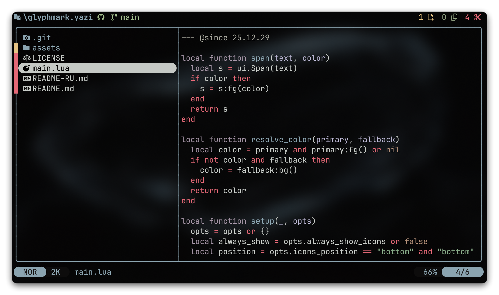

<h1 align="center">🪄glyphmark.yazi</h1>
<p align="center">
  <b>Fast, theme-aware file-operation counters for Yazi</b><br>
  <i>Track selected, copied, and cut files at a glance</i>
</p>

<p align="center">
  
</p>

> [!TIP]
> **Русская версия:** [README-RU.md](README-RU.md)

> [!IMPORTANT]
> Requires Yazi v25.12.29+\
> Requires a [Nerd Font](https://www.nerdfonts.com/) for the default symbols

## Installation

```sh
ya pkg add WhoSowSee/glyphmark
```

```sh
# Manual installation

# Linux / macOS
git clone https://github.com/WhoSowSee/glyphmark.yazi.git ~/.config/yazi/plugins/glyphmark.yazi

# Windows
git clone https://github.com/WhoSowSee/glyphmark.yazi.git "$env:APPDATA\yazi\config\plugins\glyphmark.yazi"
```

## Usage

### Enable the counters

Add the plugin to `init.lua`:

```lua
require("glyphmark"):setup()
```

### Configure options (optional)

Example block in `init.lua`:

```lua
require("glyphmark"):setup({
  -- Symbols for selected, copied, and cut files
  select_symbol = "󰻭",
  yank_symbol = "",
  cut_symbol = "󰆐",

  -- Show counters even when their value is zero
  always_show_icons = false,

  -- "top" = header, "bottom" = left side of the status bar
  icons_position = "top",
})
```

<p align="center">
  
</p>

<p align="center">
  <i><code>&copy 2026-present <a href="https://github.com/WhoSowSee">WhoSowSee</a></code></i>
</p>

<p align="center">
  <a href="https://github.com/WhoSowSee/glyphmark.yazi/blob/main/LICENSE"></a>
</p>
